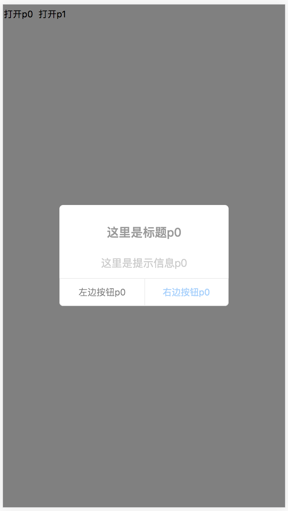
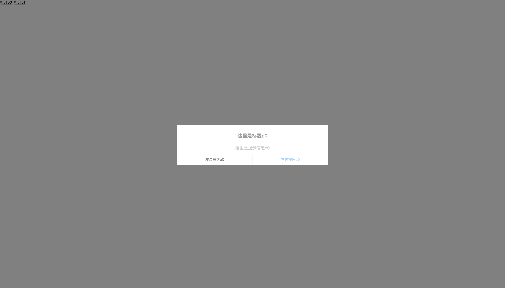

# prompt
提示确认使用

#usage
1、引入js、css
```$xslt
<link rel="stylesheet" type="text/css" href="reset.less">
<link rel="stylesheet" href="index.less">
```
2、创建示例并触发

```$xslt
var p0 = new Prompt()
    document.getElementById('open0').onclick = function (ev) {
        p0.open({
            title: '这里是标题p0',
            message: '这里是提示信息p0',
            leftButton: '左边按钮p0',
            rightButton: '右边按钮p0',
            classList: 'cls',
            maskEvent: function () {
                console.log('背景p0')
                this.close();
            },
            leftEvent: function () {
                console.log('左边按钮p0')
                this.close();

            },
            rightEvent: function () {
                console.log('右边按钮p0')
                this.close();
            }
        })
    }
```

手机版预览


pc版预览



****** 最简单的使用 *******

直接使用很简单，dist目录就是打包后的代码，打开index.html你就能看到效果

****** 启动服务的使用（fis3） *******

如果你要修改代码或者自己打包的，请安装好fis3的环境，具体操作如下：

```$xslt
npm install fis3 fis3-hook-relative fis3-parser-less-2.x fis3-preprocessor-autoprefixer -g
```
启动服务

```$xslt
npm run dev
```
浏览器打开

```$xslt
http://127.0.0.1:8080/
```


如有以为，欢迎来提 https://github.com/lijicheng123/prompt/issues

